# <center>**Projekt ASEiED**</center>
 ## Zadanie projektowe
 Dokonaj analizy danych zawierających informacje na temat poruszających się taksówek w Nowym Jorku (yellow and green taxi). Zbiór danych zawiera następujące informacje (pick-up and drop-off dates/times, pick-up and drop-off locations, trip distances, itemized fares, rate types, payment types, and driver-reported passenger counts).

 * Rok 2020 / Maj
 * Rok 2019 / Maj

 b) Skoreluj informacje dotyczące typu płatności a ilości przewożonych pasażerów 

 ## Wykorzystane technologie

* Amazon EMR
* Amazon EMR Notebooks
* Apache Spark
* Pyspark

Klaster komputerowy został utworzony z wykorzystaniem platformy **Amazon EMR**. Został na nim uruchomiony kernel **Pyspark**, który posłużył do wykonywania kodu zawartego w aplikacji **Jupyter Notebook**. Taka konfiguracja umożliwiła uruchomienie **aplikacji Sparkowej** na klastrze wykorzustując do jej programowania **API pythonowe**.  

 ## Konfiguracja klastra

 W celu stworzenia klastra komputerowego umożliwiającego uruchomienie kernela Pyspark należy postępować zgodnie z poniższymi krokami:
1. W konsoli aws wyszukujemy **EMR** i przechodzimy do zaznaczonego serwisu
   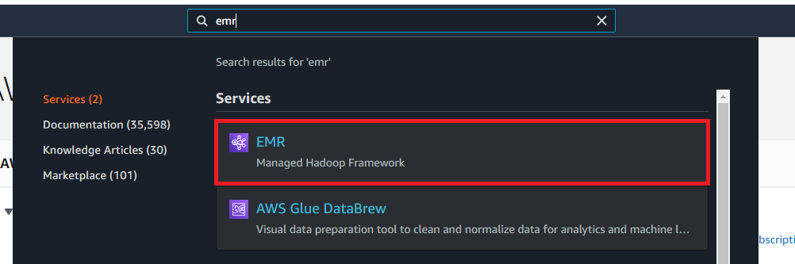
2. Klikamy create cluster
    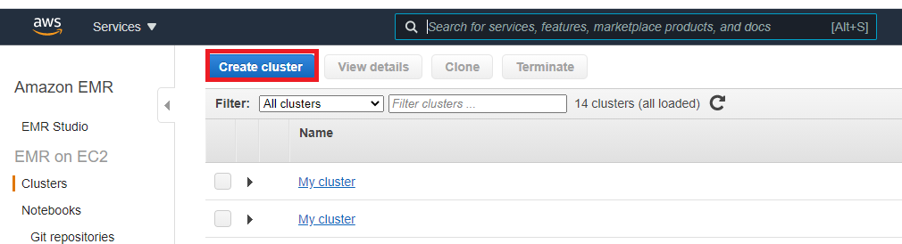
3. Naciskamy go to advanced options
   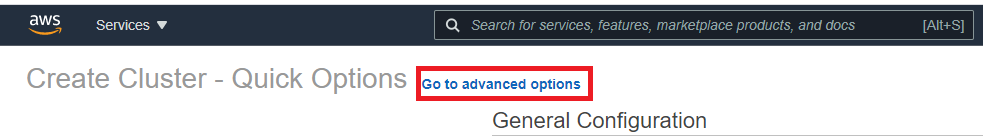
4. Zaznaczamy odpowiednie ustawienia software'u
   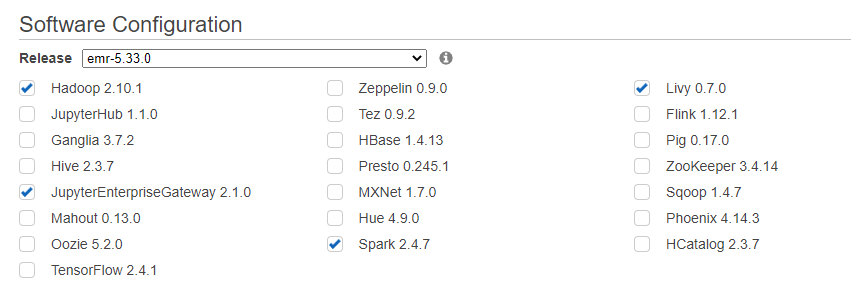
5. Przechodzimy do ustawień hardwaru i wybieramy interesującą nas konfiguracje klastra:
   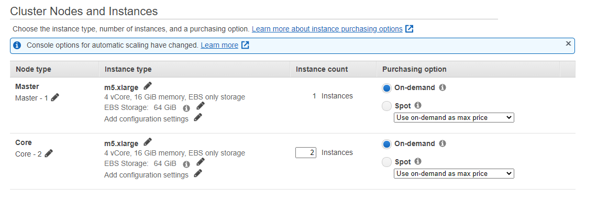
6. Przechodzimy do ogólnych ustawień i wybieramy nazwe klastra
   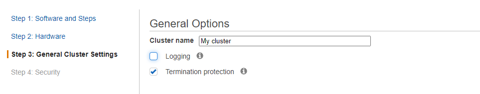
7. Przechodzimy do kolejnej sekcji i klikamy create cluster.

   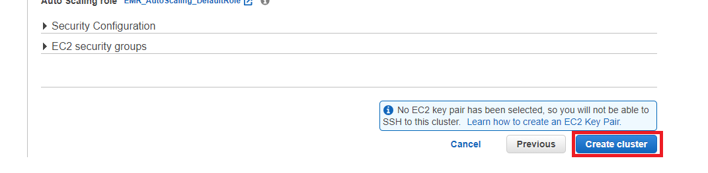

Reszta ustawień może pozostać domyślna. Bardziej zaawansowane sposoby konfiguracji zostały opisane w [1], [2].

W celu połączenia klastra z **notebookiem EMR** przechodzimy do sekcji Notebooks i tworzymy nowy notebook

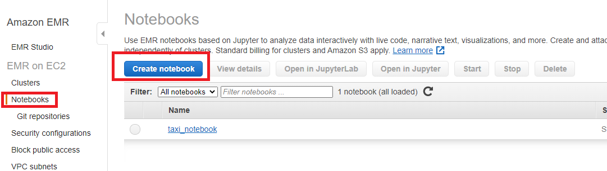

W oknie tworzenia nowego notebooka wybieramy utworzony przez nas klaster i klikamy create notebook 

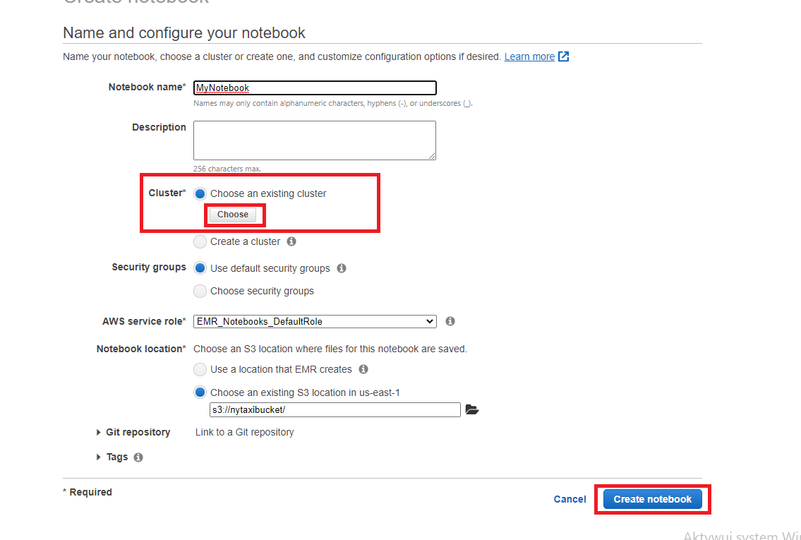

W zakładce **notebooks** powinniśmy znaleźc stworzony notebook ze statusem **ready**

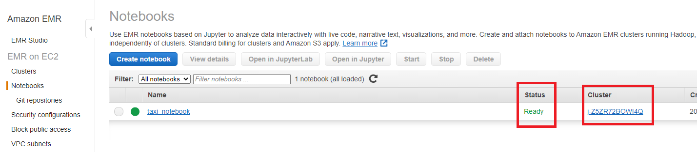

Otwieramy stworzony przez nas notebook i uruchamiamy go w JupyterLab

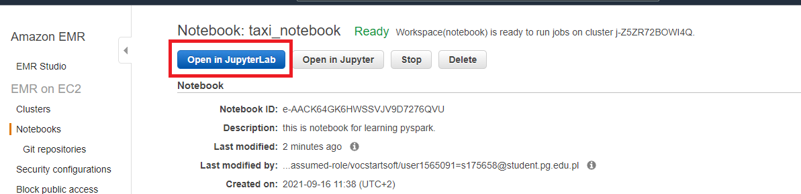

Zostajemy przekierowani na stronę z projektem w jupyter lab. Wybieramy kernel **PySpark**

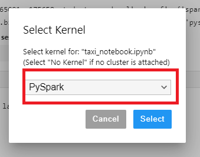 

Stworzone przez nas środowisko umożliwia na uruchomienie kodu napisanego w języku **python** rozszerzonego o biblioteke **pyspark**. 

## Uruchomienie aplikacji w celu sprawdzenia konfiguracji.

Po uruchomieniu poniższego polecenia powinniśmy uzyskać informacje o utworzeniu sesji.
```pyspark
print("Welcome to my EMR Notebook!")
```
    Starting Spark application


<table>
<tr><th>ID</th><th>YARN Application ID</th><th>Kind</th><th>State</th><th>Spark UI</th><th>Driver log</th><th>Current session?</th></tr><tr><td>1</td><td>application_1632135889412_0002</td><td>pyspark</td><td>idle</td><td><a target="_blank" href="http://ip-172-31-23-195.ec2.internal:20888/proxy/application_1632135889412_0002/" class="emr-proxy-link" emr-resource="j-Z5ZR72BOWI4Q
" application-id="application_1632135889412_0002">Link</a></td><td><a target="_blank" href="http://ip-172-31-29-131.ec2.internal:8042/node/containerlogs/container_1632135889412_0002_01_000001/livy" >Link</a></td><td>✔</td></tr></table>

    SparkSession available as 'spark'.

    Welcome to my EMR Notebook!


Możemy sprawdzić zainstalowane pakiety za pomocą polecenia

```pyspark
sc.list_packages()
```

Wyjściem będzie lista bibliotek do których mamy dostęp.


    Package                    Version  
    -------------------------- ---------
    beautifulsoup4             4.9.3    
    boto                       2.49.0   
    click                      7.1.2    
    jmespath                   0.10.0   
    joblib                     1.0.1    
    lxml                       4.6.2    
    mysqlclient                1.4.2    
    nltk                       3.5      
    nose                       1.3.4    
    numpy                      1.16.5   
    pip                        9.0.1    
    py-dateutil                2.2      
    python37-sagemaker-pyspark 1.4.1    
    pytz                       2021.1   
    PyYAML                     5.4.1    
    regex                      2021.3.17
    setuptools                 28.8.0   
    six                        1.13.0   
    tqdm                       4.59.0   
    wheel                      0.29.0   
    windmill                   1.6

W celu zainstalowania dodatkowych bilbiotek z których będziemy korzystać używamy polecenia:
```python
sc.install_pypi_package("matplotlib", "https://pypi.org/simple") #Install matplotlib from given PyPI repository
sc.install_pypi_package("time")
```

## Implementacja rozwiązania z wykorzystanie obiektów DataFrame

1. Zaczynamy od wczytania plików csv 
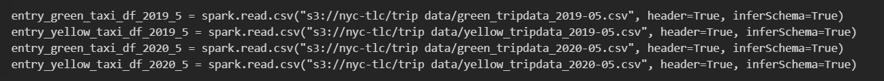

2. Następnie wyodrębniamy kolumny, które nas interesują
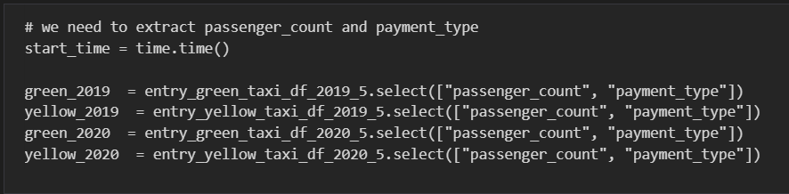

3. Łączymy dane w jeden, większy dataframe</br>
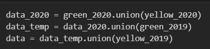

4. Rozdzielamy je względem liczby pasażerów
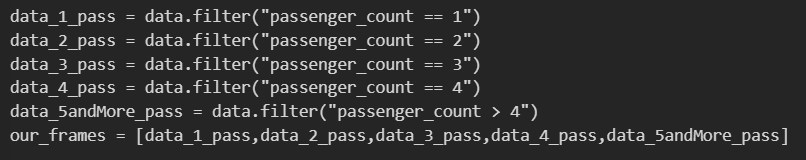

5. Następnie dla każdej liczby pasażerów wyliczamy procentowe rozłożenie typów płatności wykorzystywanych w tej grupie
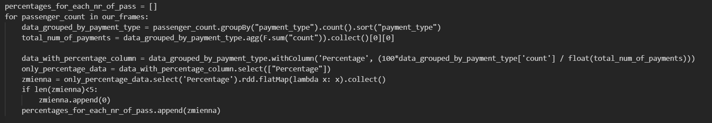

6. Ostatecznie prezentujemy dane za pomocą wykresu słupkowego w module matplotlib
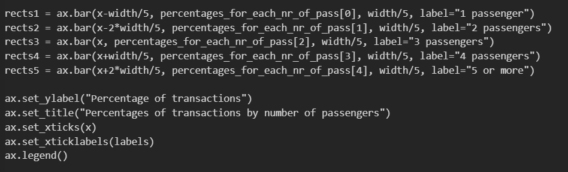

## Czas wykonania w zależności od konfiguracji klastra

Instancje m5.xlarge, 1 master node, 7 core nodes
*   --- 26.41 s ---
  
Instancje m5.xlarge, 1 master node, 3 core nodes
*   --- 41.33 seconds ---
  
Instancje m5.xlarge, 1 master node, 0 core nodes
*   --- 112.25 s ---


## Wnioski z analizy danych. 

[1]: <https://towardsdatascience.com/how-to-set-up-a-cost-effective-aws-emr-cluster-and-jupyter-notebooks-for-sparksql-552360ffd4bc>
[2]: <https://docs.aws.amazon.com/emr/latest/ManagementGuide/emr-managed-notebooks-considerations.html>
