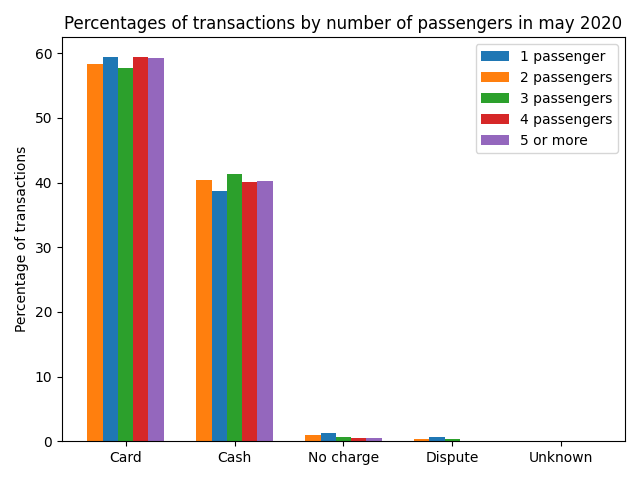
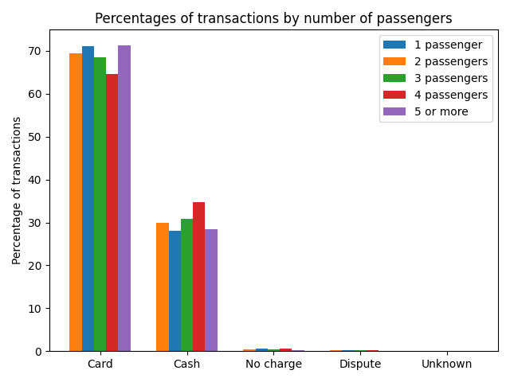
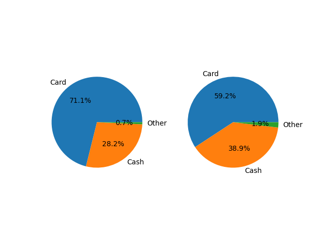

# <center>**Projekt ASEiED**</center>
 ## Zadanie projektowe
 Dokonaj analizy danych zawierających informacje na temat poruszających się taksówek w Nowym Jorku (yellow and green taxi). Zbiór danych zawiera następujące informacje (pick-up and drop-off dates/times, pick-up and drop-off locations, trip distances, itemized fares, rate types, payment types, and driver-reported passenger counts).

 * Rok 2020 / Maj
 * Rok 2019 / Maj

 b) Skoreluj informacje dotyczące typu płatności a ilości przewożonych pasażerów 

 ## Wykorzystane technologie

* Amazon EMR
* Amazon EMR Notebooks
* Apache Spark
* Pyspark

Klaster komputerowy został utworzony z wykorzystaniem platformy **Amazon EMR**. Został na nim uruchomiony kernel **Pyspark**, który posłużył do wykonywania kodu zawartego w aplikacji **Jupyter Notebook**. Taka konfiguracja umożliwiła uruchomienie **aplikacji Sparkowej** na klastrze wykorzustując do jej programowania **API pythonowe**.  

 ## Konfiguracja klastra

 W celu stworzenia klastra komputerowego umożliwiającego uruchomienie kernela Pyspark należy postępować zgodnie z poniższymi krokami:
1. W konsoli aws wyszukujemy **EMR** i przechodzimy do zaznaczonego serwisu
   
2. Klikamy create cluster
    
3. Naciskamy go to advanced options
   
4. Zaznaczamy odpowiednie ustawienia software'u
   
5. Przechodzimy do ustawień hardwaru i wybieramy interesującą nas konfiguracje klastra:
   
6. Przechodzimy do ogólnych ustawień i wybieramy nazwe klastra
   
7. Przechodzimy do kolejnej sekcji i klikamy create cluster.

   

Reszta ustawień może pozostać domyślna. Bardziej zaawansowane sposoby konfiguracji zostały opisane w [1], [2].

W celu połączenia klastra z **notebookiem EMR** przechodzimy do sekcji Notebooks i tworzymy nowy notebook


W oknie tworzenia nowego notebooka wybieramy utworzony przez nas klaster i klikamy create notebook 


W zakładce **notebooks** powinniśmy znaleźc stworzony notebook ze statusem **ready**


Otwieramy stworzony przez nas notebook i uruchamiamy go w JupyterLab


Zostajemy przekierowani na stronę z projektem w jupyter lab. Wybieramy kernel **PySpark**

 

Stworzone przez nas środowisko umożliwia na uruchomienie kodu napisanego w języku **python** rozszerzonego o biblioteke **pyspark**. 

## Uruchomienie aplikacji w celu sprawdzenia konfiguracji.

Po uruchomieniu poniższego polecenia powinniśmy uzyskać informacje o utworzeniu sesji.
```pyspark
print("Welcome to my EMR Notebook!")
```
    Starting Spark application


<table>
<tr><th>ID</th><th>YARN Application ID</th><th>Kind</th><th>State</th><th>Spark UI</th><th>Driver log</th><th>Current session?</th></tr><tr><td>1</td><td>application_1632135889412_0002</td><td>pyspark</td><td>idle</td><td><a target="_blank" href="http://ip-172-31-23-195.ec2.internal:20888/proxy/application_1632135889412_0002/" class="emr-proxy-link" emr-resource="j-Z5ZR72BOWI4Q
" application-id="application_1632135889412_0002">Link</a></td><td><a target="_blank" href="http://ip-172-31-29-131.ec2.internal:8042/node/containerlogs/container_1632135889412_0002_01_000001/livy" >Link</a></td><td>✔</td></tr></table>

    SparkSession available as 'spark'.

    Welcome to my EMR Notebook!


Możemy sprawdzić zainstalowane pakiety za pomocą polecenia

```pyspark
sc.list_packages()
```

Wyjściem będzie lista bibliotek do których mamy dostęp.


    Package                    Version  
    -------------------------- ---------
    beautifulsoup4             4.9.3    
    boto                       2.49.0   
    click                      7.1.2    
    jmespath                   0.10.0   
    joblib                     1.0.1    
    lxml                       4.6.2    
    mysqlclient                1.4.2    
    nltk                       3.5      
    nose                       1.3.4    
    numpy                      1.16.5   
    pip                        9.0.1    
    py-dateutil                2.2      
    python37-sagemaker-pyspark 1.4.1    
    pytz                       2021.1   
    PyYAML                     5.4.1    
    regex                      2021.3.17
    setuptools                 28.8.0   
    six                        1.13.0   
    tqdm                       4.59.0   
    wheel                      0.29.0   
    windmill                   1.6

W celu zainstalowania dodatkowych bilbiotek z których będziemy korzystać używamy polecenia:
```python
sc.install_pypi_package("matplotlib", "https://pypi.org/simple") #Install matplotlib from given PyPI repository
sc.install_pypi_package("time")
```

## Implementacja rozwiązania z wykorzystanie obiektów DataFrame

1. Zaczynamy od wczytania plików csv 
```python
entry_green_taxi_df_2019_5 = spark.read.csv("s3://nyc-tlc/trip data/green_tripdata_2019-05.csv", header=True, inferSchema=True)
entry_yellow_taxi_df_2019_5 = spark.read.csv("s3://nyc-tlc/trip data/yellow_tripdata_2019-05.csv", header=True, inferSchema=True)
entry_green_taxi_df_2020_5 = spark.read.csv("s3://nyc-tlc/trip data/green_tripdata_2020-05.csv", header=True, inferSchema=True)
entry_yellow_taxi_df_2020_5 = spark.read.csv("s3://nyc-tlc/trip data/yellow_tripdata_2020-05.csv", header=True, inferSchema=True)
```

2. Następnie wyodrębniamy kolumny, które nas interesują
```python
# we need to extract passenger_count and payment_type
start_time = time.time()

green_2019  = entry_green_taxi_df_2019_5.select(["passenger_count", "payment_type"])
yellow_2019  = entry_yellow_taxi_df_2019_5.select(["passenger_count", "payment_type"])
green_2020  = entry_green_taxi_df_2020_5.select(["passenger_count", "payment_type"])
yellow_2020  = entry_yellow_taxi_df_2020_5.select(["passenger_count", "payment_type"])
```
3. Łączymy dane w jeden, większy dataframe</br>
```python
data_2020 = green_2020.union(yellow_2020)
data_temp = data_2020.union(green_2019)
data = data_temp.union(yellow_2019)
```

4. Rozdzielamy je względem liczby pasażerów
```python
data_1_pass = data.filter("passenger_count == 1")
data_2_pass = data.filter("passenger_count == 2")
data_3_pass = data.filter("passenger_count == 3")
data_4_pass = data.filter("passenger_count == 4")
data_5andMore_pass = data.filter("passenger_count > 4")
our_frames = [data_1_pass,data_2_pass,data_3_pass,data_4_pass,data_5andMore_pass]
```
5. Następnie dla każdej liczby pasażerów wyliczamy procentowe rozłożenie typów płatności wykorzystywanych w tej grupie
```python
percentages_for_each_nr_of_pass = []
for passenger_count in our_frames:
    data_grouped_by_payment_type = passenger_count.groupBy("payment_type").count().sort("payment_type")
    total_num_of_payments = data_grouped_by_payment_type.agg(F.sum("count")).collect()[0][0]

    data_with_percentage_column = data_grouped_by_payment_type.withColumn('Percentage', (100*data_grouped_by_payment_type['count'] / float(total_num_of_payments)))
    only_percentage_data = data_with_percentage_column.select(["Percentage"])
    zmienna = only_percentage_data.select('Percentage').rdd.flatMap(lambda x: x).collect()
    if len(zmienna)<5:
        zmienna.append(0)
    percentages_for_each_nr_of_pass.append(zmienna)
```

6. Ostatecznie prezentujemy dane za pomocą wykresu słupkowego w module matplotlib
```python
rects1 = ax.bar(x-width/5, percentages_for_each_nr_of_pass[0], width/5, label="1 passenger")
rects2 = ax.bar(x-2*width/5, percentages_for_each_nr_of_pass[1], width/5, label="2 passengers")
rects3 = ax.bar(x, percentages_for_each_nr_of_pass[2], width/5, label="3 passengers")
rects4 = ax.bar(x+width/5, percentages_for_each_nr_of_pass[3], width/5, label="4 passengers")
rects5 = ax.bar(x+2*width/5, percentages_for_each_nr_of_pass[4], width/5, label="5 or more")

ax.set_ylabel("Percentage of transactions")
ax.set_title("Percentages of transactions by number of passengers")
ax.set_xticks(x)
ax.set_xticklabels(labels)
ax.legend()
```
## Czas wykonania w zależności od konfiguracji klastra

Instancje m5.xlarge, 1 master node, 7 core nodes
*   --- 26.41 s ---
  
Instancje m5.xlarge, 1 master node, 3 core nodes
*   --- 41.33 seconds ---
  
Instancje m5.xlarge, 1 master node, 0 core nodes
*   --- 112.25 s ---


## Wnioski z analizy danych. 
Rozkład poszczególnych sposobów zapłaty ze względu na liczbę pasażerów w maju 2019:

 

Rozkład poszczególnych sposobów zapłaty ze względu na liczbę pasażerów w maju 2020:

 

Ogólny rozkład poszczególnych sposobów zapłaty ze względu na liczbę pasażerów:

 

Procentowy rozkład sposobów zapłaty kolejno na maj 2019 oraz maj 2020:

 

Sumaryczna ilość przejazdów w danym miesiącu:
* maj 2019 - 8070148
* maj 2020 - 405731


Z pierwszych wykresów możemy zauważyć, że liczba pasażerów nie ma szczególnego wpływu na ostateczny sposób zapłaty. W maju 2019 widoczny jest wyraźny wzrost w płatności gotówką, w momencie gdy przewożonych jest 4 pasażerów, jednak sytuacja ta nie powtarza się zarówno w przyszłym roku, jak i dla większej liczby pasażerów.

W maju 2020 notujemy widoczny spadek w procentowej liczbie płatności kartą w stosunku do poprzedniego roku. Różnica ta jest zaskakująca, ze względu na to, że maj 2020 był jednym z pierwszych miesiąców pandemii, kiedy to w dużym stopniu zachęcono do płatności kartą. Jednym z powodów powyższej statystyki może być fakt, że ludzie w tym okresie w panice przed upadłością banków masowo wypłacali swoje oszczędności.

Z sumarycznej ilości przejazdów widać jak mocno ucierpiał rynek taksówkarski podczas pandemii. Różnica między majem 2019 a majem 2020 jest ogromna, niemal dwudziestokrotna. Poza pandemią, powodem takiego spadku może być też stale rosnąca popularność innych firm przewozowych.


[1]: <https://towardsdatascience.com/how-to-set-up-a-cost-effective-aws-emr-cluster-and-jupyter-notebooks-for-sparksql-552360ffd4bc>
[2]: <https://docs.aws.amazon.com/emr/latest/ManagementGuide/emr-managed-notebooks-considerations.html>
